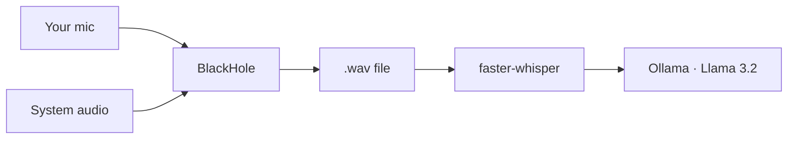

## The trade-off nobody questions
One day I woke up and thought: why can't I use the default capabilities of my Mac? The hardware, the microphone, a free transcription script, and a free AI model like Ollama running locally; that's easily enough to build my own Granola.

But my goal here wasn't really to build a Granola substitute. It's to try to think like a creator or a product owner, not just a consumer. Why should I pay a monthly fee for a tool when, especially with AI, I can understand how it works and build it myself? (Setting aside the case where I work at a company that's already paying for it. Which, let's be honest, probably performs better than my afternoon build.) It was also just a good way to keep my engineering hands busy while I'm between roles, a real problem to chew on..

Tools like Granola have made AI meeting recording feel almost mandatory now: join a call, and someone's already running a bot that transcribes and summarizes everything. I like the idea but I’m feeling that sometimes I don't like where the audio/com goes.

If I care about the privacy layer and want the whole conversation to stay on my machine, that's the way to do it. (Turns out I wasn't the first person to think this. In fact there are already local-first alternatives out there. More on that at the end, once I've walked through what I built and why building it myself was still worth it.)

Most of these tools ship your recordings to the cloud by default. That's the trade-off nobody really questions: convenience for a copy of every conversation you have, sitting on someone else's servers. I wanted the convenience without the trade-off. And it turns out my own laptop is already powerful enough to do the whole job: recording, transcription, summarization. All without a single byte leaving the machine.

## What it actually does
So, what did I build in an afternoon? (And I’m not bragging, nowadays, once you have a clear idea for a simple tool like this, an AI assistant, in my case Cursor, lets you build it straight away).

The architecture: use my machine to record an audio file, run a transcription script, powered by faster-whisper, on a suggestion from Cursor's Composer 2.5 and finally run the transcript through a free local LLM, Ollama, to summarize it and pull out hints or action items from the conversation.

A bit more detail: the pipeline is simple once it's running. Record audio to a .wav file, transcribe it locally with Whisper (I used the faster-whisper implementation), then summarize the transcript with a small open-source model running through Ollama; I'm using a 2GB Llama 3.2 build, small enough to run comfortably in the background.

The trickier part was audio routing, which is where BlackHole comes in. macOS doesn't let you casually intercept audio between apps, so BlackHole acts as a virtual audio driver, basically a pipe you can route sound through. I use it twice, for two different jobs:

A Multi-Output Device (BlackHole + my speakers/headphones), so I can hear the call and capture whatever the other person is saying.
An Aggregate Device (BlackHole + my microphone), so my own voice gets captured too.

Between the two, both sides of the conversation end up in the recording, without needing anything to touch a network connection.

In practice: a 15-minute call transcribes in about 20 seconds. Summarizing that transcript pulls the 2.3GB Llama 3.2 model into memory running entirely on the CPU on my M3 Max, out of 36GB of unified memory total, so there's plenty of room left over for whatever else I've got open.

## Not just online calls
My first instinct, actually, was to build something closer to Heypocket or Plaud (small wearable hardware device you carry around and record from anywhere). But building hardware wasn't the point of this project, and I already had a perfectly capable device sitting in front of me. So I scoped it down: start with the Mac I already have, skip the hardware entirely, and see how far a software-only version could go.

That decision ended up shaping the whole scope. This shouldn't only work for Zoom calls. Half the conversations worth capturing happen in a room: a discussion with a colleague, a quick chat that was never going to be a scheduled online meeting in the first place. Because the recording happens at the OS audio layer rather than inside a specific app, it doesn't care whether the conversation is happening over a call or three feet from my microphone. If my machine can hear it, it can record it.

## How I actually built it
The process itself was a bit of a loop between two AI tools. I started with a design conversation with an LLM to work out what the application actually needed to be and why: the privacy goal, the local-only constraint, the rough architecture. That became a written spec, which I fed into Cursor and let its Composer model turn into an actual build plan and, from there, working code.

From that first iteration, most of the work was testing and verifying the pipeline actually held up and so that recordings were clean, transcriptions were usable, summaries were actually useful rather than generic. At that stage I also started going back over code that felt "finished" with a second model: GPT-5.5, alongside whatever I'd been building with, deliberately getting a different perspective on the same code rather than staying locked into one model's way of doing things. It's a technique I'm still curious about: I'd like to know how other people are approaching this, and whether there's a better way to run multiple models against the same problem than just switching between them one at a time. (I know it's not an unheard-of idea… plenty of developers cross-check models this way but, I haven't found a settled answer on the best way to do it).

## From CLI to menu bar
The first working version lived entirely in a terminal: activate a virtual environment, run the script, watch the logs. That was fine for me, but not for anyone else. Once the core pipeline was solid, the next stage was wrapping it in an actual interface: a small macOS menu bar app that opens a popup to start and stop recording, with the Python backend still doing the real work underneath. It's a small UI, but it's the difference between "a script I run" and "an app I could hand to someone else."

## The two cents
None of this is exotic technology: Whisper, Ollama, and a virtual audio driver are all things anyone can pick up. What made it worth building wasn't the AI part, it was refusing to accept the default trade-off everyone else has quietly accepted: that useful AI tools have to phone home. They don't. I’m opinionated but sometimes I think the more interesting engineering problem is figuring out how to keep something entirely on your own machine, not how to make it smarter in the cloud.

Since building this, I've come across tools like Descript and Meetily that do a version of this ( Descript as a paid, cloud-based editing platform, Meetily as an open-source project with real traction doing local-first transcription the same way mine does). I'm glad they exist; it tells me the instinct was right. But that was never really the point for me. The point was building something free, native to my own Mac, and entirely under my own control, using my own judgment and AI as the accelerant, rather than paying for someone else's version of the same idea.

I'll also admit: in a normal context, I probably never would have spent the time to build this from scratch. What made it possible was leaning on AI as a real accelerant rather than treating it as cheating. It replaces the hours you used to spend Googling, digging through Stack Overflow threads, piecing together an answer from different sources, with something faster and more often than not, more reliable. However I think that speed only works in your favor if you already know enough to tell a good answer from a hallucinated one. The tool doesn't replace understanding; it removes the friction around applying it.

Short version: AI is a genuinely great tool. It's going to keep improving how we build and how we learn. I recommend using it; just keep using your own brain alongside it.

If any of this is useful to you, the pipeline, the BlackHole routing trick, or just the itch to build your own version instead of subscribing to one: https://github.com/criscara-dev/meeting-recorder. Let me know if you build on it.

## Updates

**Aug 2026** — Added speaker diarization using [pyannote.audio](https://github.com/pyannote/pyannote-audio), suggested by Nikolay Makhov in the comments on LinkedIn. Transcripts can now label who said what (Speaker A, Speaker B, …) instead of one unlabeled stream — a real gap on longer, multi-person calls. It's optional and runs fully locally; setup and details are in the [repo README](https://github.com/criscara-dev/meeting-recorder).
